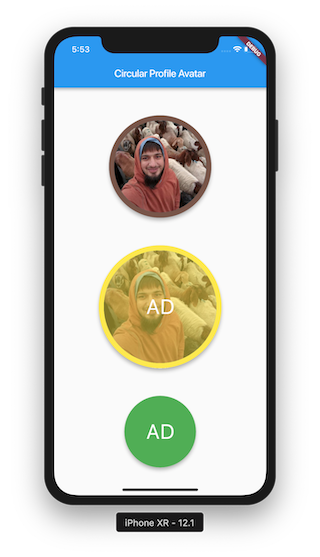

# circular_profile_avatar

CircularProfileAvatar is a Flutter package which allows developers to implement circular profile avatar with border, overlay, initialsText and many other awesome features, which simplifies developers job. It is an alternative to Flutter's [CircleAvatar](https://docs.flutter.io/flutter/material/CircleAvatar-class.html) Widget.

# Installation
         
   Add this to your package's pubspec.yaml file:      
         
    dependencies:
       circular_profile_avatar: ^0.1.7

and run 

     flutter packages get

# Usage

       
 
        CircularProfileAvatar(
              'https://avatars0.githubusercontent.com/u/8264639?s=460&v=4', //sets image path, it should be a URL string. default value is empty string, if path is empty it will display only initials
              radius: 100, // sets radius, default 50.0              
              backgroundColor: Colors.transparent, // sets background color, default Colors.white
              borderWidth: 10,  // sets border, default 0.0
              initialsText: Text(
                "AD",
                style: TextStyle(fontSize: 40, color: Colors.white),
              ),  // sets initials text, set your own style, default Text('')
              borderColor: Colors.brown, // sets border color, default Colors.white
              elevation: 5.0, // sets elevation (shadow of the profile picture), default value is 0.0
              foregroundColor: Colors.brown.withOpacity(0.5), //sets foreground colour, it works if showInitialTextAbovePicture = true , default Colors.transparent
              cacheImage: true, // allow widget to cache image against provided url
              onTap: () {
                print('adil');
              }, // sets on tap 
              showInitialTextAbovePicture: true, // setting it true will show initials text above profile picture, default false  
              )
        )

If this project help you reduce time to develop, you can give me a cup of coffee :) 

[Give me through Paypal -> ](https://paypal.me/madil7)

## Getting Started

This project is a starting point for a Dart
[package](https://flutter.io/developing-packages/),
a library module containing code that can be shared easily across
multiple Flutter or Dart projects.

For help getting started with Flutter, view our 
[online documentation](https://flutter.io/docs), which offers tutorials, 
samples, guidance on mobile development, and a full API reference.
